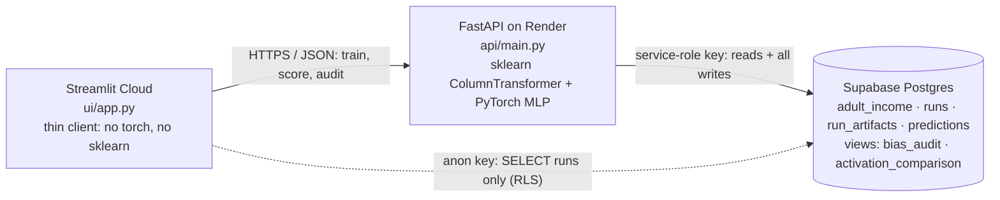

# Income-Insight — A Tabular Classification Service

**Income-Insight predicts whether a person earns more than \$50K a year from 10
census attributes, tells you how much to trust each probability, and shows who
the model's mistakes fall on.** A deep MLP trained on the real UCI Adult census
data is served from a FastAPI API, every run and prediction is persisted in
Supabase, and a Streamlit dashboard lets anyone score a person or a whole CSV,
inspect calibration and per-class performance, compare activation functions, and
read a bias audit of false-positive and false-negative rates by sex and race.

## Live deployment URLs

| Tier | Platform | URL |
|------|----------|-----|
| **UI** | Streamlit Community Cloud | https://income-insight-luke.streamlit.app |
| **API** | Render.com | https://income-insight-api.onrender.com |
| **Data** | Supabase | https://yaqjquaklabercwjxldv.supabase.co |

> The Render free tier sleeps when idle; the first request can take 30–60 s to wake it.

**Engineering report:** [docs/ENGINEERING_REPORT.md](docs/ENGINEERING_REPORT.md):
forward and backward propagation in matrix form with every shape, the XOR worked
example, the algorithm, analysis of the findings, the ethical consideration, and
references.

---

## Architecture



- **UI (Streamlit)** never touches the model or writes to the database. The
  Score-a-Row form is generated from the API's `/schema` endpoint.
- **API (Render)** is the only writer. It loads the newest successful run's
  serialized sklearn + PyTorch pipeline **at startup**, trains on request, and
  logs every prediction.
- **Data (Supabase)** is the single source of truth. Row-level security lets the
  public anon key read only `runs`; the bias audit and activation comparison are
  **SQL views**.

## Streamlit tabs

| Tab | What it does |
|-----|--------------|
| **Concepts** | MLP forward and backward propagation in matrix form, calibration, FPR / FNR (rendered from `docs/CONCEPTS.md`) |
| **Train** | Pick depth, width, activation, learning rate, batch size, epochs, seed, training-set size, and whether sex / race are inputs |
| **Score a Row** | Form auto-generated from `/schema`, with an adjustable decision threshold |
| **Score a CSV** | Upload a CSV (template provided), score every row, download the results |
| **Model Performance** | Train / val / test accuracy, per-class precision / recall / F1, confusion matrix, calibration plot, loss curves, permutation importance, and the activation comparison table |
| **Bias Audit** | FPR and FNR by sex or race, computed in SQL, with gaps and mitigation options |
| **Run History** | Every run, read straight from Supabase with the anon key |
| **Model Card** | `MODEL_CARD.md` |

## Data

The [UCI Adult](https://archive.ics.uci.edu/dataset/2/adult) dataset: 48,842
records from the 1994 US Current Population Survey (`adult.data` + `adult.test`
combined). 23.9% earn >50K.

| Role | Columns |
|------|---------|
| Numeric inputs (standardized) | `age`, `education_num`, `capital_gain`, `capital_loss`, `hours_per_week` |
| Categorical inputs (one-hot) | `workclass`, `marital_status`, `occupation`, `relationship`, `native_country` |
| Protected attributes (audited, **not** inputs by default) | `sex`, `race` |
| Target | `income` (`<=50K` / `>50K`) |
| Dropped | `fnlwgt` (a census sampling weight, not a trait of the person), `education` (text duplicate of `education_num`) |

`db/load_adult.py` downloads the files, maps `?` to `Unknown`, and assigns a
**fixed, stratified 70 / 15 / 15 train / val / test split** (seed 42: 34,189 /
7,326 / 7,327 rows). Every run uses the same split, so runs are directly
comparable. The 10 inputs expand to 84 features after one-hot encoding.

## Model

`Input(84) → [Linear → activation] × n_layers → Linear(1) → sigmoid`, trained
with Adam on binary cross-entropy (`BCEWithLogitsLoss`). Defaults: 2 hidden
layers × 32 units, **tanh**, lr 0.005, batch 256, 15 epochs, seed 0, a 15,000-row
training sample (keeps a run around 30 s on Render's free tier; set it to 0 to
use all 34,189 rows). A run whose loss goes NaN/Inf or ends higher than it
started is stored as `status = 'diverged'` with **NULL** metrics. It is never
given a sentinel number, and it is never served.

## Results (defaults, seed 0)

The numbers below come from the default configuration and are reproducible:
the same split and seed give the same run.

| Split | Accuracy |
|-------|----------|
| Train | 0.859 |
| Validation | 0.845 |
| Test | 0.847 |

Test split (tanh), threshold 0.5:

| Class | Precision | Recall | F1 | Support |
|-------|-----------|--------|----|---------|
| `<=50K` | 0.886 | 0.917 | 0.901 | 5,574 |
| `>50K` | 0.702 | 0.625 | 0.661 | 1,753 |

ROC-AUC 0.899, Brier score 0.106, expected calibration error 0.023.

**`>50K` is the harder class.** It is the minority (24% of rows), so a model
that minimizes average loss leans toward predicting `<=50K`. Its members are
also more heterogeneous: high earners include executives, professionals with
capital gains, and long-hours workers, while most `<=50K` rows look alike.
About 37% of true high earners are missed at the default threshold. Lowering
the threshold raises their recall at the cost of precision.

**Calibration:** predicted probabilities track observed rates closely at the
extremes (ECE 0.023). In the middle and upper range the model is somewhat
over-confident: rows predicted around 0.65 are >50K about 55% of the time, and
rows predicted around 0.84 about 74% of the time.

## Activation-function comparison

Three runs that differ **only** in the hidden-layer activation: same split,
seed (0), training sample (15,000 rows), architecture (2 × 32), lr (0.005),
batch (256), and budget (15 epochs). The table is the `activation_comparison`
SQL view over the `runs` table (`select * from activation_comparison;`, also
shown in the Model Performance tab):

| Activation | Train acc | Val acc | Test acc | Test F1 (>50K) | Test ROC-AUC | Brier | ECE |
|------------|-----------|---------|----------|----------------|--------------|-------|-----|
| relu | 0.8705 | 0.8444 | 0.8486 | 0.6498 | 0.8962 | 0.1069 | 0.0339 |
| **tanh** | 0.8594 | 0.8452 | 0.8469 | **0.6612** | 0.8987 | 0.1057 | 0.0227 |
| sigmoid | 0.8604 | 0.8471 | 0.8462 | 0.6533 | **0.8996** | **0.1051** | **0.0191** |

**Choice: tanh.** Accuracy is a near-tie (all within 0.25 points), so the
decision rests on the harder class and on trustworthiness:

- tanh has the **best F1 on `>50K`**, the class the model struggles with.
- relu has the largest train–validation gap (0.026 vs 0.014 for tanh), i.e. it
  overfits the 15,000-row sample most, and the worst calibration (ECE 0.034).
- sigmoid is the best calibrated, but its outputs saturate, and it learns
  slowest (highest final training loss).
- tanh is zero-centered, which keeps the next layer's inputs balanced and gives
  stronger gradients than sigmoid near zero.

The differences are small, and this is a single seed. Repeating the comparison
with other seeds (change Seed on the Train tab) adds rows to the view; a gap
that holds across seeds is evidence, while one that flips is noise.

## Bias audit

Computed by the `bias_audit` SQL view, which joins each run's 7,327 test-split
predictions to the true labels and protected attributes in `adult_income`.
Default model (sex and race are **not** inputs), threshold 0.5:

| Sex | Test rows | True >50K rate | Predicted >50K rate | FPR | FNR |
|-----|-----------|----------------|---------------------|-----|-----|
| Female | 2,414 | 0.110 | 0.080 | 0.026 | **0.477** |
| Male | 4,913 | 0.303 | 0.278 | 0.119 | 0.357 |

(The Bias Audit tab shows the live numbers for any run.)

- **FNR gap 0.12:** the model misses **nearly half (48%) of the women who truly
  earn >50K**, compared with 36% of the men.
- **FPR gap 0.094:** men who earn ≤50K are about 4.6× as likely as women to be
  wrongly flagged as high earners.
- **Leaving sex out of the inputs did not remove the gap.** The model never sees
  `sex`, yet the gap is there, because `relationship` (Husband / Wife) and
  `marital_status` act as proxies for it and the 1994 labels themselves encode a
  real wage gap. Training *with* sex and race as inputs (same seed) only narrows
  the FNR gap from 0.12 to 0.09. "Fairness through unawareness" is not enough.
- **By race,** Black (FNR 0.469) and Amer-Indian-Eskimo (0.429) earners are
  missed more often than White (0.373) or Asian-Pac-Islander (0.294) earners.
  Several race groups have fewer than 100 test rows, so their rates carry wide
  uncertainty.

**What the gap implies for deployment:** if a lender, landlord, or benefits
office used this score as an income check, a missed high earner (false
negative) is a person wrongly treated as lower income, e.g. denied credit they
qualify for. That error lands disproportionately on women.

**Mitigation options**

1. **Per-group thresholds (post-processing):** choose a lower threshold for the
   group with the higher FNR so FNR is equalized (equal opportunity). This is
   simple and effective, but it requires using the protected attribute at
   decision time, which may be restricted by law.
2. **Reweighting or resampling (pre-processing):** up-weight high-earning women
   in training so the loss pays more attention to them.
3. **Remove proxies:** drop `relationship` (the strongest sex proxy). This
   usually costs accuracy, and other proxies remain, so it must be measured,
   not assumed.
4. **Do not automate the decision:** use the score only as one input to a human
   review, and publish the audit with it.

## Permutation importance

Drop in validation ROC-AUC when one input column is shuffled (3 repeats). The
Model Performance tab shows it for any run. Default configuration:

| Feature | AUC drop |
|---------|----------|
| `marital_status` | 0.088 |
| `capital_gain` | 0.038 |
| `age` | 0.029 |
| `hours_per_week` | 0.026 |
| `education_num` | 0.023 |
| `occupation` | 0.019 |
| `capital_loss` | 0.006 |
| `relationship` | 0.006 |
| `workclass` | 0.002 |
| `native_country` | 0.001 |

**Marital status drives the predictions most.** Being married
(`Married-civ-spouse`) is the single strongest signal. In 1994 data this
reflects household and life-stage patterns, and it is also the main channel
through which sex information reaches a model that never sees sex.
`relationship` scores low only because it is redundant with `marital_status`:
shuffling one leaves the other intact. Capital gains, age, hours, and education
behave as expected. `native_country` and `workclass` add little once the others
are known.

## Data persisted / not persisted

| Persisted (Supabase) | Where | Who can read it |
|----------------------|-------|-----------------|
| UCI Adult records with fixed split | `adult_income` | API only |
| Run settings, train/val/test metrics, confusion matrix, per-class scores, calibration bins, permutation importance, loss curves | `runs` | API; anon key via RLS (Run History) |
| Fitted sklearn preprocessor + PyTorch weights (base64 pickle) | `run_artifacts` | API only |
| Every prediction: run, probability, label, threshold, source (`row` / `csv` / `test_eval`), and either the submitted features or the `adult_income` id | `predictions` | API only |

**Not persisted:** uploaded CSV *files* (only their scored rows, as predictions),
model state between requests beyond an in-memory cache (it is reloaded from
`run_artifacts`), user identities (there are no accounts), and the service-role
key (Render environment variable only; never in the repo). The dataset has no
names or direct identifiers. Rows entered in Score a Row / Score a CSV are
stored, so users should not submit real people's data.

## API endpoints

| Method | Path | Purpose |
|--------|------|---------|
| `POST` | `/train` | Train on `adult_income`; persist run, artifact, and test-split predictions |
| `GET`  | `/runs` | Recent runs (summary) |
| `GET`  | `/runs/{run_id}` | One run with confusion matrix, per-class scores, calibration, importance, loss curves |
| `POST` | `/predict` | Score one row (defaults to the newest successful run); log it |
| `POST` | `/predict_batch` | Score up to 5,000 rows; log each |
| `GET`  | `/schema` | Feature contract (drives the auto-generated form) |
| `GET`  | `/bias_audit?run_id=&attribute=sex\|race` | FPR / FNR per group from the SQL view |
| `GET`  | `/activation_comparison` | The SQL activation-comparison view |
| `GET`  | `/healthz` | Liveness, DB ping, and the run loaded at startup |
| `GET`  | `/version` | Build SHA + torch / sklearn versions |

Database failures return **503** with a readable message, bad input returns
**422**, and a diverged run returns **409** instead of being served.

## Project structure

```
Topic_2_income-insight/
├── README.md · MODEL_CARD.md
├── docs/
│   ├── ENGINEERING_REPORT.md # Matrix-form backprop, XOR example, analysis, ethics
│   └── CONCEPTS.md           # Concepts tab content
├── shared/
│   ├── schemas.py            # Pydantic API contract
│   └── data.py               # Feature contract, UCI cleaning, fixed split, test fixture generator
├── api/                      # FastAPI tier (Render)
│   ├── main.py               # Endpoints, startup model load, 503 handler
│   ├── training.py           # MLP, training loop, metrics, calibration, permutation importance
│   ├── db.py                 # Supabase (service-role) access
│   └── requirements.txt      # CPU-only torch
├── ui/app.py                 # 8-tab Streamlit thin client
├── db/
│   ├── migrations/001_init.sql · 002_depth_status_threshold.sql · 003_adult_income_audit.sql
│   └── load_adult.py         # Download + clean + split + load UCI Adult
├── scripts/xor_matrix_backprop.py  # NumPy XOR worked example (matrix-form backprop)
├── tests/                    # pytest suite (run in GitHub Actions on every push)
└── render.yaml
```

## Run it locally

```bash
python -m venv .venv
.venv\Scripts\activate                     # Windows; macOS/Linux: source .venv/bin/activate
pip install -r requirements-dev.txt
pytest -q                                  # offline suite; live test runs only with a .env
```

Set up the database once: in the Supabase SQL Editor, run
`db/migrations/001_init.sql`, `002_depth_status_threshold.sql`, and
`003_adult_income_audit.sql` in order. Then copy `.env.example` to `.env`
(add the service-role key) and run:

```bash
python -m db.load_adult                    # ~48.8k rows into adult_income
uvicorn api.main:app --reload --port 8000  # terminal 1
streamlit run ui/app.py                    # terminal 2 (needs ui/.streamlit/secrets.toml)
```

## Testing

`pytest -q` runs these tests. GitHub Actions
(`.github/workflows/income-insight-tests.yml`) runs them on every push:

| Category | File |
|----------|------|
| Schema / input validation (422s) | `test_schema.py`, `test_healthz.py` |
| Batch row count and order | `test_batch.py` |
| Regression: learns signal, reproducible, consistent metrics | `test_training.py` |
| Depth, activations, divergence (NULL + 409), threshold | `test_extensions.py` |
| Bias audit FPR / FNR vs sklearn, activation comparison | `test_fairness.py` |
| Supabase-failure path (503, degraded health) and startup pipeline load | `test_resilience.py` |
| XOR gradients vs finite differences | `test_xor.py` |
| Live Supabase write + both SQL views (skips without credentials) | `test_supabase_roundtrip.py` |

## Team

| Member | Contribution | Video walkthrough |
|--------|--------------|-------------------|
| Luke Hoyle | Three-cloud deployment, API, data pipeline, bias audit, Streamlit dashboard, tests, engineering report, documentation | [Watch on YouTube](https://youtu.be/Vvrmqfs3mQ8) |
| Second team member | No contribution to this submission | — |

### Individual contribution statements

**Luke Hoyle.** I deployed and connected all three clouds (Supabase, the FastAPI
service on Render, and the Streamlit dashboard). I moved the project from
synthetic data to the real UCI Adult dataset with a fixed stratified split and
wrote the loader. I extended the model to a configurable deep MLP with five
activation functions, train / validation / test evaluation, calibration,
per-class metrics, and permutation importance, and I stored diverged runs as
NULL instead of a sentinel. I built the bias audit and the activation comparison
as SQL views, added the Score a CSV, Model Performance, and Bias Audit tabs,
wrote the test suite (including the Supabase-failure path) and the GitHub Actions
workflow, and wrote the README and model card. I also wrote the engineering
report: the matrix-form forward and backward propagation derivation with every
shape, the XOR worked example, the algorithm, the analysis of the findings, and
the ethical consideration.

**Second team member.** Did not contribute to this submission.

### Video walkthroughs

**Luke Hoyle:** the product end to end, the theory behind it, and my contribution.

▶ [Watch the walkthrough on YouTube](https://youtu.be/Vvrmqfs3mQ8)
